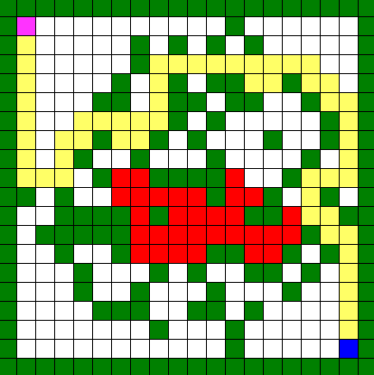

# Maze Search
Gui application uses different algorithms to navigate a maze using autonomous thinking factors (all decisions are made by the AI in the maze to take necessary steps to reach safety - Using implemented Algorithms). Player agent is suppose to escape fire cells and reach the Goal State.

<p align="center">
  
</p>

## Installing & Running
Download the complete project in one folder, import project in your IDE, compile and run.

## For command line
```
open cmd
Navigate to directory
run python
python main.py
```

## Must have Installed
Numpy
<br>
Pygame

